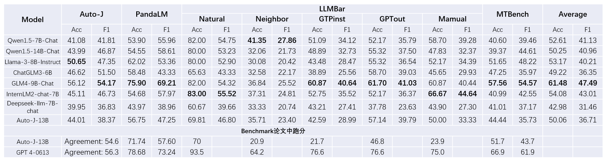
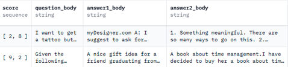
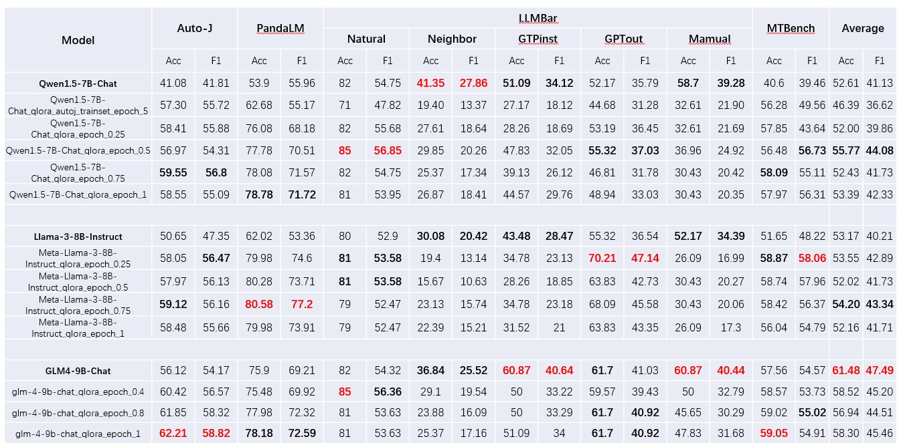
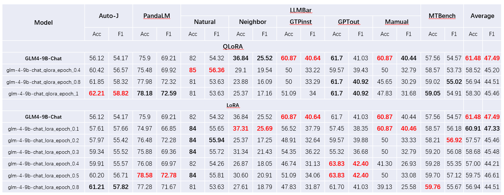

NLP Project, tested on PandaLM testset, Auto-J testset, MT-bench and LLMBar benchmark dataset

### 模型选择

通过OpenCompass2.0大语言模型评测榜单的客观综合和主观综合部分初选出了以下几个开源模型，囿于硬件性能，我们只选择了模型大小14B以下的模型。在此基础上，添加上前天开源的GLM4-9B-chat模型以及给定的Benchmark所提供的两个用于评估的两个模型Autoj-13B以及PandaLM-7B-v1。

- [Qwen1.5-7B-Chat](https://huggingface.co/Qwen/Qwen1.5-7B-Chat)
- [Qwen1.5-14B-Chat](https://huggingface.co/Qwen/Qwen1.5-14B-Chat)
- [Llama-3-8B-Instruct](https://huggingface.co/meta-llama/Meta-Llama-3-8B-Instruct)
- [ChatGLM3-6B](https://huggingface.co/THUDM/chatglm3-6b)
- [GLM-4-9b-chat](https://huggingface.co/THUDM/glm-4-9b-chat)
- [InternLM2-chat-7B](https://huggingface.co/internlm/internlm2-chat-7b)
- [Deepseek-llm-7B-chat](https://huggingface.co/deepseek-ai/deepseek-llm-7b-chat)
- [Autoj-13B](https://huggingface.co/GAIR/autoj-13b)
- [PandaLM-7B](https://huggingface.co/WeOpenML/PandaLM-7B-v1)

### 模型基础跑分

使用上述模型分别以Auto-J评估代码中的Prompt以及我们自己写的Prompt在4个给定的Benchmark上进行跑分。Base模型跑分结果如下表：

其中PandaLM-7B支持的最大Token数为2048，小于大多数输入的Token数，输出结果几乎不可解析，故而未列出来。

由下表可以看到GLM4的平均表现是最好的，加上Qwen1.5以及LLama3的表现尚可且微调支持最多，故而选择GLM4-9B-Chat、Qwen1.5-7B-Chat以及Llama-3-8B-Instruct进行微调。

### Prompt 选择

本次实验先采用Auto-J提供的prompt以及解析结果的脚本进行baseline的构建，发现该prompt会将大模型的判断放到最后这使得大模型的数据较长（普遍输出200-300个tokens）导致推理时间花费较长，以及prompt中所规定的格式对于部分大模型有难度，这使得大模型未能生成所要求的格式导致结果难以提取。所以我们选择更换我们自己写的prompt，我们新的prompt只要求模型输出[0]，[1]，[2]中的一个，这使得输出大大缩短（只需要3个tokens）同时结构足够简单，提取不出结果的情况大大减少。

### 微调数据集选择

微调数据集我们选择了Auto-J提供的trainset以及BAAI/JudgeLM-100K数据集。我们选择先用Qwen1.5-7B-Chat上使用两个数据集进行训练，其中Auto-J trainset约有3500条数据，训练到接近5个epoch时收敛，JudgeLM-100K则取了前16500条数据，与Auto-J训练5个epoch的数据量对齐。发现以JudgeLM-100K训练的结果均优于以Auto-J trainset训练的结果，同时考虑到其数据量足够大，问题类型足够广，所以后续训练集均采用BAAI/JudgeLM-100K。

其数据组织格式如下：（只截取需要使用的部分）

其中Score为List，是由GPT4给出的对Answer1和Answer2的评分。

通过我们的Prompt将question_body，answer1_body和answer2_body拼接起来得到输入。而将分数更高的作为回答序号作为标签，如果两者分数相等则标签为[0]。

### 微调方法选择与超参数设置

碍于硬件，微调方法选择4bit量化QLoRA，GLM4同时也采用了LoRA方法以作对比，因为BAAI/JudgeLM-100K数据集量足够所以epoch设置为1。

LoRA微调中lora_rank=8，learning_rate=1e-4，max_seq_length=8192

QLoRA微调中lora_rank=64， learning_rate=2e-4，max_seq_length=8192

### 模型微调结果

### 模型微调结果分析

由上述微调模型跑分结果来看，不同模型在除LLMBar下Neighbor，GTPinst以及Mamual以外的测试集上的评分均有较大的提升，且大多随着微调epoch的增大而增大。这在Qwen1.5-7B-Chat以及Llama-3-8B-Instruct上的提升尤为明显，同样的在上述三个数据集上的表现的下降也尤为明显。猜测是训练集的多数问题的类型与上述3种问题的类型存在偏差，使得模型微调后表现下降。

**GLM4-9B-Chat**使用LoRA在BAAI/JudgeLM-100K训练集上微调0.1个epoch（10k条数据）后的综合表现在微调后的模型中最好，但同样在上述三个类型的问题上表现较有下降，所以得到的平均Acc和F1不如base模型。

使用LoRA在BAAI/JudgeLM-100K训练集上微调1个epoch除开上述三个测试集的情况下综合表现最好，但在上述三个类型的问题上表现下降严重，或许可以根据不同的问题类型以选择合适的模型。

### 实验过程总结和感想

本次必做部分的实验在不同的prompt上尝试了多个不同结构以及不同参数大小的开源模型的效果，完成了baseline的构建；同时选出基础表现比较优秀的模型，在两个不同的数据集上采用LoRA与QLoRA的微调方法进行微调，并对微调后的模型性能进行评估，得到了最终的LLM as a judge模型。通过本次实验，我熟练了大模型的部署以及通过vllm批量推理，对大模型本身的工作原理以及部分参数有了更深的理解。同时也看到了prompt engineering的强大作用，最后还熟悉了大模型微调的数据处理以及大模型微调。
